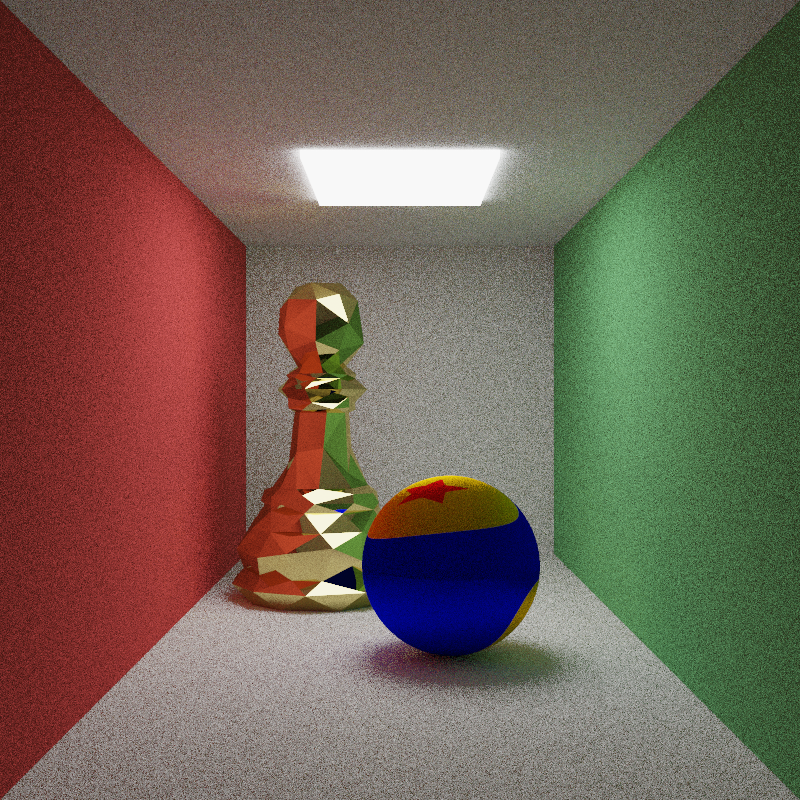
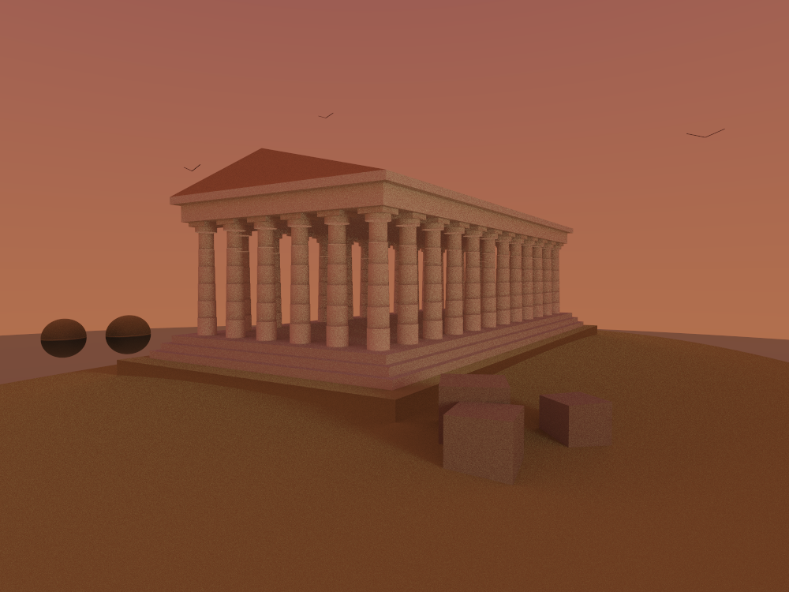

# RayTraceRS 🦀

[](LICENSE.md)
[](https://www.rust-lang.org/)
[](HISTORY.md)
[](https://github.com/scaioo/RayTraceRS/actions/workflows/rust_CI.yml)

**RayTraceRS** is a physically based, Monte Carlo **path tracer** written in Rust,
driven by its own **scene description language**. You write a plain-text file
describing shapes, materials, lights and a camera, and the renderer traces light
through the scene to produce a high-dynamic-range image, then tone-maps it to a
viewable PNG or JPEG.



> A Cornell box where the two usual blocks are replaced by a sphere textured with
> the Pixar ball and a golden chess-pawn mesh. Nothing is directly lit except the
> ceiling panel — every other tint on the ball and the pawn is **indirect light**
> bouncing off the coloured walls. Scene: [`examples/cornell_ball_pawn.txt`](examples/cornell_ball_pawn.txt).

---

## What v1.0.0 delivers

This is the first stable release. The engine now supports, end to end:

- **A scene description language** — a lexer and a recursive-descent parser turn a
  `.txt` scene file into a renderable world. Named materials, reusable `float`
  variables, and command-line variable overrides (`--declare-float`) are all
  supported.
- **Primitives**: `sphere`, `plane`, `aabb` (axis-aligned box), `box` (orientable
  parallelepiped), `cylinder`, and triangle **meshes** loaded from Wavefront `.obj`
  files.
- **Materials**: uniform, checkerboard, gradient and **HDR/LDR image** textures,
  combined with **diffuse** or **perfect-specular** BRDFs and
  optional self-emission.
- **Cameras**: perspective and orthogonal (axonometric) projections.
- **Renderers**: a full Monte Carlo `pathtracing` integrator, a Whitted-style
  `point-light` renderer with hard shadows, plus `flat` and `onoff` debug modes.
- **Lights**: emissive surfaces, punctual `point_light`s, and area
  `spherical_light`s.
- **Antialiasing** via per-pixel supersampling, and **multi-threaded rendering**
  across all CPU cores through [`rayon`](https://crates.io/crates/rayon).
- **HDR image I/O**: read/write `.pfm`, tone-map (Reinhard) and gamma-correct to
  `.png`/`.jpg`.

---

## Gallery

### Greek temple at sunset



A hexastyle temple built entirely from the scene language: columns are stacks of
tapering **cylinders**, the crepidoma is a set of axis-aligned **boxes**, the roof
is a triangle **mesh**, and the whole scene is lit by an emissive gradient sky
acting as a soft area light. Scene: [`examples/greek_temple.txt`](examples/greek_temple.txt).

> **⚠️ Still rough — and a nice excuse for a digression.** The cornice reads as
> slightly skewed, which is a known rough edge of this render. It also makes a good
> point: *perfectly regular* geometry — mathematically exact straight lines and
> true right angles — often looks subtly **wrong** to the human eye. Greek
> architects knew this and corrected for it on purpose. Our temple is the
> opposite experiment — dead-regular geometry — which is exactly why the roofline
> doesn't sit quite right yet.

---

## 🚀 Getting started

### Prerequisites

The Rust toolchain, **Rust 1.85+** (edition 2024). Install it via
[rustup](https://rustup.rs/).

### Build and test

```sh
# Run the test suite
cargo test --release

# Build the optimized binary (the release profile enables LTO)
cargo build --release
```

The binary is named `rstrace`. You can run it with `cargo run --release -- <args>`
or directly as `./target/release/rstrace <args>`.

### Render your first scene

```sh
cargo run --release -- render examples/demo.txt \
    --num-of-rays 10 --max-depth 3 --antialiasing 4
```

This writes an HDR `.pfm` and a tone-mapped `.png` into `outputs/` by default.

---

## Command-line interface

The `rstrace` binary has two subcommands: **`render`** and **`pfm-ldr`**.

### `render` — parse and render a scene file

```sh
rstrace render <SCENE.txt> [OPTIONS]
```

It produces both a raw HDR `.pfm` file and a tone-mapped raster image.

| Option | Default              | Description |
| --- |----------------------| --- |
| `--width <N>` | `1000`               | Output image width, in pixels. |
| `--height <N>` | `750`                | Output image height, in pixels. |
| `--algorithm <ALG>` | `pathtracing`        | `pathtracing`, `point-light`, `flat`, or `onoff`. |
| `--num-of-rays <N>` | `5`                  | Rays sampled per bounce (path tracer). |
| `--max-depth <N>` | `3`                  | Maximum ray recursion depth. |
| `--antialiasing <N>` | `5`                  | Samples per pixel side (total = N²). |
| `--reflectance-policy <P>` | `reject`             | Handling of out-of-range reflectance: `reject`, `rescale`, `ignore`. |
| `--format <FMT>` | `png`                | Raster output format: `png`, `jpg`, `jpeg`. |
| `--pfm-output <PATH>` | `outputs/output.pfm` | Path for the HDR `.pfm` output. |
| `--image-output <PATH>` | `outputs/output`     | Path for the tone-mapped raster output. |
| `--threads <N>` | `0`                  | Rendering threads; `0` uses all cores, `1` disables threading. |
| `--declare-float <VAR:VALUE>` | —                    | Define/override a scene variable (repeatable, `-d` for short). |
| `--init-state <N>` / `--init-seq <N>` | `45` / `54`          | Seed the PCG random number generator. |
| `--tab-size <N>` | `4`                  | Tab width used when reporting parser error columns. |

> **Note on `--reflectance-policy`.** The path tracer has no direct-light sampling,
> so scenes rely on indirect bounces and often want higher `--num-of-rays` /
> `--antialiasing` than the defaults. Scenes that use LDR image textures (e.g.
> `cornell_ball_pawn.txt`) can produce reflectances slightly above `1.0` after inverse
> tone mapping; render those with `--reflectance-policy rescale`.

### `pfm-ldr` — convert an HDR image to LDR

```sh
rstrace pfm-ldr <INPUT.pfm> <OUTPUT.png> [--factor-a 0.18] [--gamma 2.2]
```

Applies tone mapping (average-luminosity normalization, `--factor-a`) and gamma
correction (`--gamma`) to turn a floating-point `.pfm` into a viewable image. The
output format is derived from the output file extension.

---

## 📝 The scene description language

A scene file is a sequence of top-level statements: `float` declarations, `material`
declarations, shapes, lights and a `camera`. Statements are read top to bottom, so
a shape must appear **after** the material it references.

A minimal, complete scene:

```text
# An emissive sky lighting a red sphere on the ground, seen in perspective.
material sky(uniform(black), diffuse(), uniform(<0.7, 0.8, 1.0>))
sphere(sky, scaling(100))

material red(uniform(<0.8, 0.1, 0.1>), diffuse(), uniform(black))
sphere(red, translation([0, 0, 1]))
plane(red, identity, true)

camera(perspective, translation([-2, 0, 1]), 1.0)
```

### Building blocks

- **Shapes**: `sphere`, `plane`, `aabb`, `box`, `cylinder`, `simple_mesh`.
- **Pigments**: `uniform(color)`, `checkered(c1, c2, steps)`, `gradient(c1, c2, k)`,
  `image("path"[, factor_a, avg_lum, gamma])`.
- **BRDFs**: `diffuse()`, `specular()`.
- **Materials**: `material name(pigment, brdf, emitted_pigment)`.
- **Lights**: `point_light(point([...]), color)`,
  `spherical_light(point([...]), radius, color, samples)`.
- **Camera**: `camera(perspective | orthogonal, transformation, distance)`.
- **Transformations** compose with `*`: `identity`, `translation([x,y,z])`,
  `rotation_x/y/z(deg)`, `scaling([x,y,z])` or `scaling(k)`.
- **Colors** are `<r, g, b>` or the keywords `black` / `white`; **vectors** are
  `[x, y, z]`; any number may be a literal or a `float` variable name.

### `aabb` vs `box`

Both are cuboids, but they are placed differently. `aabb(material, point([...]),
point([...]))` is an **axis-aligned** box given by two opposite corners — it reads
straight off the geometry but cannot be rotated. `box(material, transformation)` is
the unit cube placed by a transformation, so it can be translated, scaled **and
rotated**. Use `aabb` for axis-aligned blocks (walls, steps), `box` when the cube
must be oriented.

The full grammar lives at the top of [`src/parser.rs`](src/parser.rs).

---

## 📂 Example scenes

Every scene in [`examples/`](examples/) is ready to render. Suggested commands (they
match the notes in each file's header):

| Scene | What it shows | Suggested command |
| --- | --- | --- |
| [`cornell_ball_pawn.txt`](examples/cornell_ball_pawn.txt) | GI, image texture, mesh, mirror BRDF | `render examples/cornell_ball_pawn.txt --num-of-rays 4 --max-depth 4 --antialiasing 6 --reflectance-policy rescale` |
| [`demo.txt`](examples/demo.txt) | Sky dome, checker floor, diffuse + mirror spheres | `render examples/demo.txt --num-of-rays 5 --max-depth 3 --antialiasing 4` |
| [`greek_temple.txt`](examples/greek_temple.txt) | Cylinders + boxes + mesh, emissive sky | `render examples/greek_temple.txt --width 900 --height 600 --num-of-rays 3 --max-depth 3 --antialiasing 6` |
| [`orthogonal.txt`](examples/orthogonal.txt) | Orthographic camera, every primitive | `render examples/orthogonal.txt --num-of-rays 20 --max-depth 3 --antialiasing 4` |

Prefix each with `cargo run --release --` (heavier scenes really want `--release`).

---

## 🏗️ Architecture

The crate is layered from low-level math up to the full rendering pipeline:

```text
┌─────────────────────────────────────────────┐
│                 Rendering                   │
│        image_tracer  ←  renderer            │
│               ↑            ↑                │
│            camera         world             │
│                            ↑                │
│                      light_source           │
├─────────────────────────────────────────────┤
│                   Scene                     │
│     shapes / mesh  ←  materials  ←  pigments│
│                                  ←  brdf    │
│                   hit_record                │
├─────────────────────────────────────────────┤
│            Scene language                   │
│              lexer  →  parser               │
├─────────────────────────────────────────────┤
│                 Math / IO                   │
│  geometry  transformations  ray  color      │
│  functions  pcg  hdr_image  pfm_func        │
└─────────────────────────────────────────────┘
```

### Directory structure

```text
RayTraceRS/
├── assets/               # Meshes (.obj) and textures used by scenes
├── docs/images/          # Screenshots used in this README
├── examples/             # Ready-to-render scene files
├── outputs/              # Generated images (git-ignored)
├── src/
│   ├── main.rs           # CLI entry point (render / pfm-ldr)
│   ├── cli.rs            # CLI helpers (arg parsing, path handling)
│   ├── lib.rs            # Crate root and public API
│   ├── lexer.rs          # Tokenizer for the scene language
│   ├── parser.rs         # Scene-language parser → World + Camera
│   ├── geometry.rs       # Vectors, points, normals, UVs, ONB
│   ├── transformations.rs# Affine transforms (translate/scale/rotate)
│   ├── ray.rs            # Ray type and transformation
│   ├── color.rs          # Colour type and tone mapping
│   ├── functions.rs      # Math utilities and constants
│   ├── pcg.rs            # PCG pseudo-random number generator
│   ├── pigments.rs       # Pigment trait and texture implementations
│   ├── brdf.rs           # BRDFs (diffuse, specular)
│   ├── materials.rs      # Material (pigment + BRDF + emission)
│   ├── shapes.rs         # Sphere, Plane, AABB, Cube, Cylinder, Triangle
│   ├── mesh.rs           # SimpleMesh: OBJ loading, indexed triangles
│   ├── hit_record.rs     # Ray-surface intersection data
│   ├── world.rs          # Scene container and closest-hit traversal
│   ├── light_source.rs   # Point and spherical light sources
│   ├── camera.rs         # Perspective / orthogonal cameras
│   ├── renderer.rs       # OnOff, Flat, PointLight, PathTracer
│   ├── image_tracer.rs   # Rendering loop (fires rays, fills the image)
│   ├── hdr_image.rs      # HDR buffer, tone mapping, PNG/JPEG export
│   └── pfm_func.rs       # PFM file I/O and byte order
├── tests/                # Integration tests
├── Cargo.toml
├── HISTORY.md            # Changelog
├── LICENSE.md            # EUPL-1.2
└── README.md
```

The full module-by-module API overview is documented in
[`src/lib.rs`](src/lib.rs); run `cargo doc --open` to browse it.

---

## 🗺️ Beyond v1.0.0

Ideas on the table for future releases:

- [ ] Constructive Solid Geometry (deferred from v1.0.0 in favour of the new
      `box` / `cylinder` primitives).
- [ ] An acceleration structure (e.g. a BVH) to speed up large meshes and scenes.
- [ ] Refractive/dielectric materials (glass).
- [ ] Direct light sampling (next-event estimation) to cut path-tracer noise.

---

## 👥 Authors

- Andrea Scaioli
- Marta Viola
- Isacco Forlani

## 📜 License

Licensed under the **European Union Public Licence v1.2 (EUPL-1.2)**. See
[LICENSE.md](LICENSE.md).
